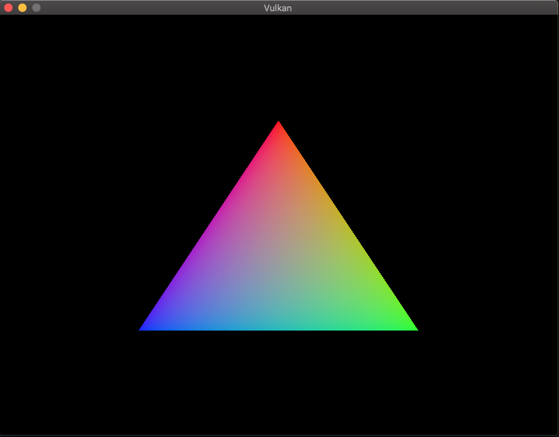

# Vulkan_First_Project
Vulkan project from the tutorial at: https://vulkan-tutorial.com/, with some experimentations.

## Triangle

Getting this triangle on screen involves several concepts in Vulkan, including surface, swapchain, renderpass, framebuffers, fences and semaphores.

