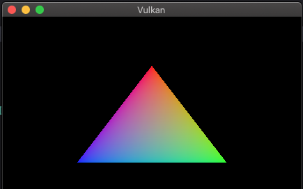
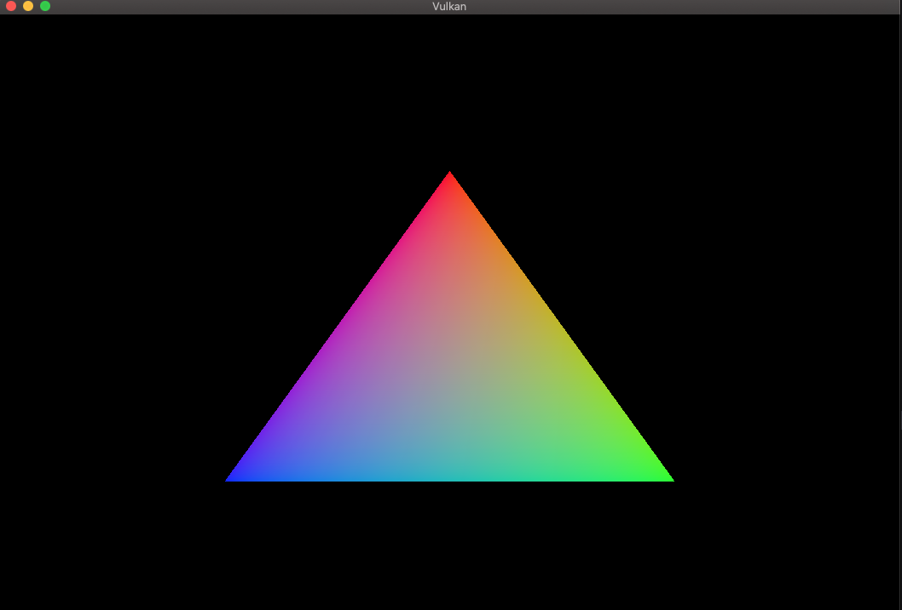
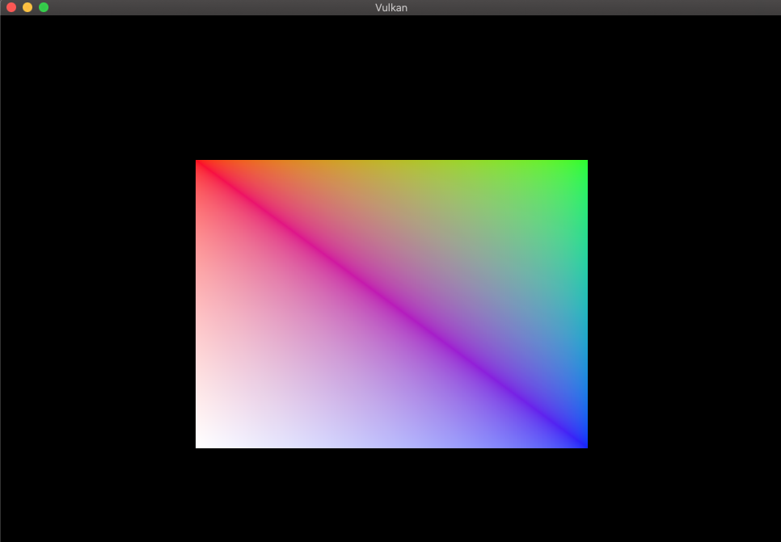

# Vulkan_First_Project
Vulkan project from the tutorial at: https://vulkan-tutorial.com/, with some experimentations.

## Triangle

Getting this triangle on screen involves several concepts in Vulkan, including surface, swapchain, renderpass, framebuffers, fences and semaphores, index and vertex buffers.

### Resizable Window

Baremetal swapchain resize by detecting window changes and then recreate swapchain with new extent.

### Index Buffer Draw

