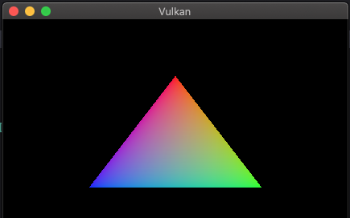
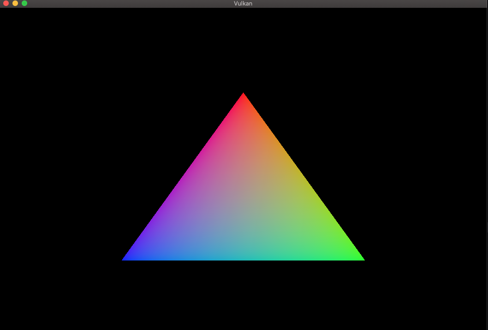
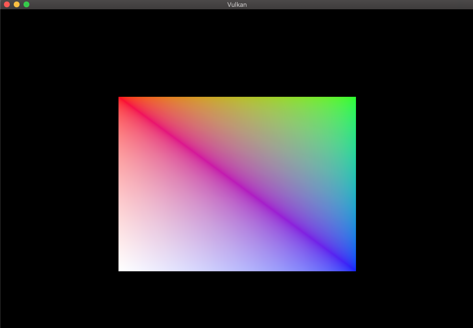
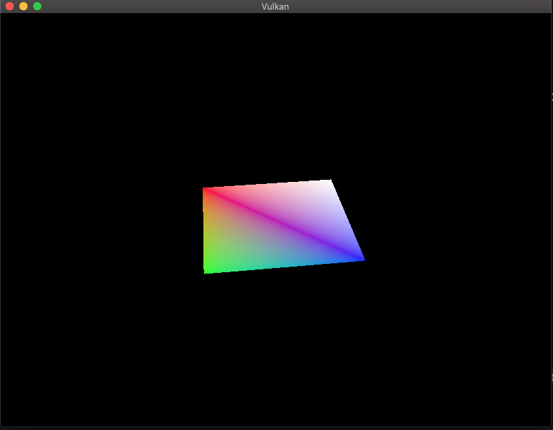
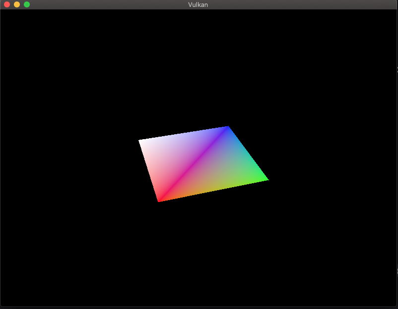
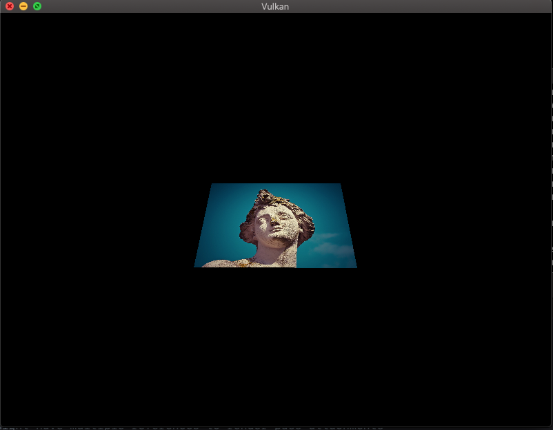
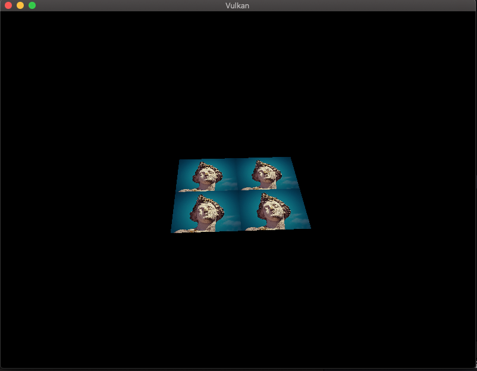
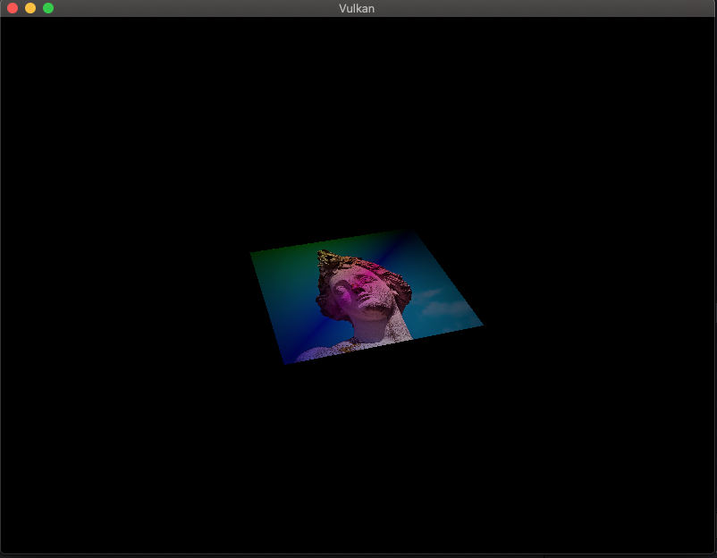
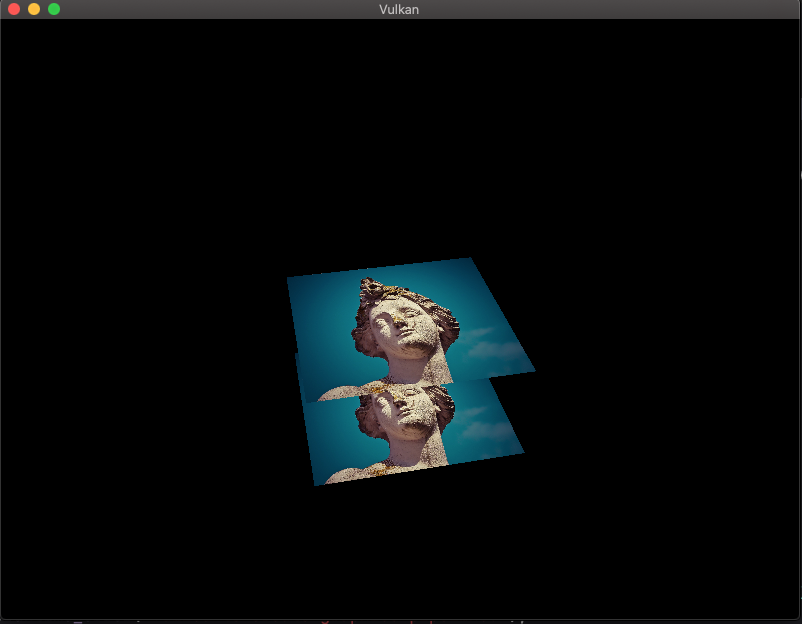

# Vulkan_First_Project

A simple vulkan project adapted from: https://vulkan-tutorial.com/, with some of my own experimentations. The program runs on macOS 10.15.6 with 2.7 GHz Quad-Core Intel Core i5 CPU processor, 8GB 1600 MHz DDR3 memory, and Intel Iris Pro 1536 MB integrated GPU.

## Triangle

Getting this triangle on screen involves several concepts in Vulkan, including surface, swapchain, renderpass, framebuffers, fences and semaphores, index and vertex buffers, push constants and descriptor sets, texture mapping, and depth testing.

### Resizable Window

Baremetal swapchain resize by detecting window changes and then recreate swapchain with new extent.

### Index Buffer Draw

### Descriptor Sets and Push Constants

For this milestone I added descriptor sets support for view and projection matrices, and push constant for model update so that the rectangle can spin around. 

### Texture Mapping

I added functionaltiy to: 1) load images from CPU buffer to GPU texture memory while handling image layout transitions, 2) pass texture image as descriptors and descriptor sets to graphics pipeline for shader read, 3) create texture sampler to sample textures from the fragment shader. 

### Depth Testing

Depth buffering is added to enable the perception of depth to the scene.  Fortunately, depth testing in Vulkan can be enabled through creating and adding depth attachment at the renderpass and enabling depth testing in the graphics pipeline. In addition, the depth buffer needs to be created on GPU for sure. 

